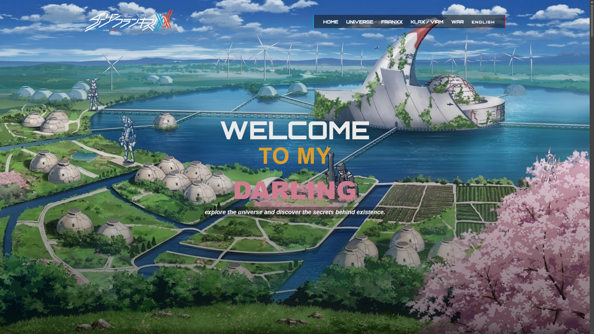
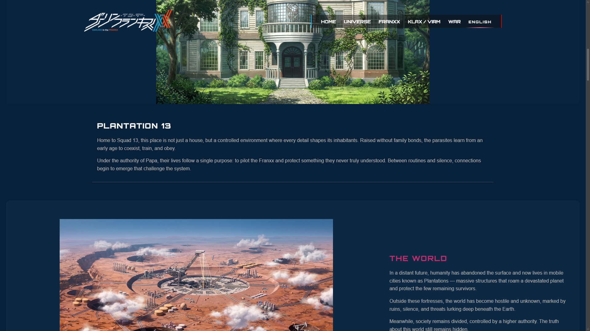
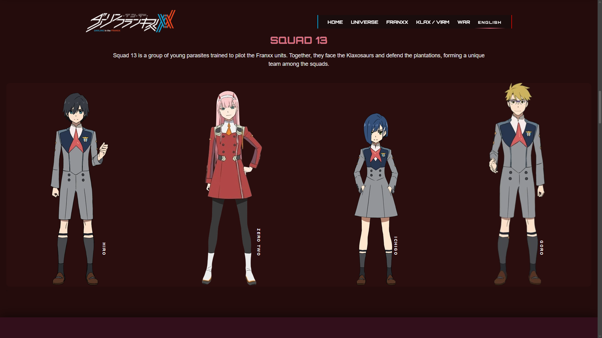
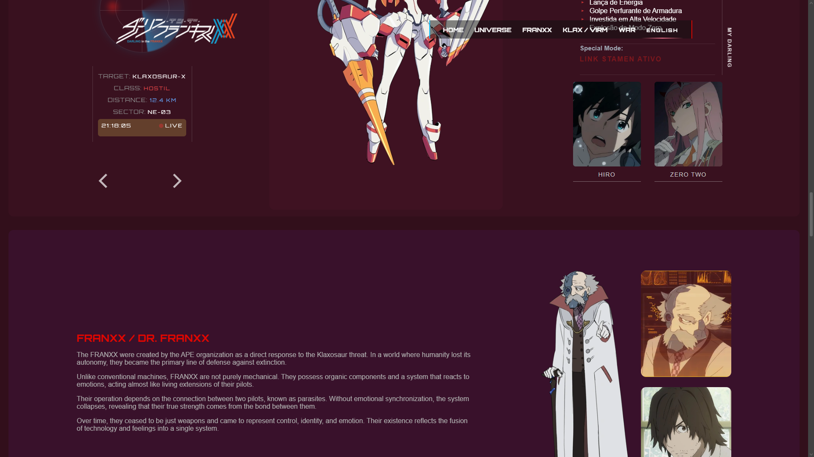

# myDarling

myDarling é um projeto web interativo inspirado no universo de Darling in the Franxx.

O projeto foi desenvolvido com foco em design imersivo, experiência de usuário fluida e conteúdo dinâmico. Possui uma interface em estilo HUD futurista, seções animadas e sistema bilíngue (PT/EN) para acessibilidade.

Este projeto representa a evolução no desenvolvimento front-end, combinando HTML, CSS e JavaScript para criar uma experiência completa e interativa.

---

## Tech Stack

- HTML5
- CSS3 (arquitetura modular com @import)
- JavaScript (manipulação do DOM)

---

## Features

- Sistema de troca de idiomas (PT-BR / EN)
- Interface de usuário futurista inspirada em sistemas HUD de ficção científica
- Renderização dinâmica de conteúdo com JavaScript
- Animações baseadas em scroll
- Design responsivo (mobile friendly)
- Estrutura CSS modular

---

## Screenshots

## What I learned

- Como estruturar um projeto front-end escalável
- Organização de CSS utilizando arquivos modulares
- Manipulação do DOM e renderização dinâmica de conteúdo
- Técnicas de design responsivo
- Pensamento de UI/UX para experiências interativas

---

## Author

Desenvolvido por **João Paulo**

🔗 [GitHub](https://github.com/jaozinpaulin)
